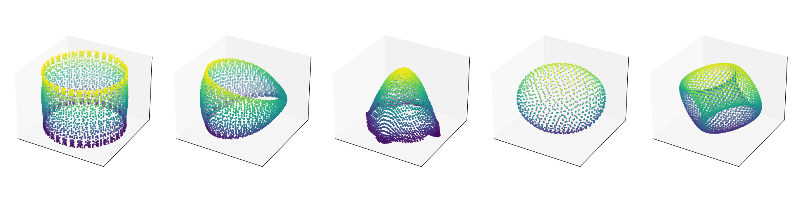

# Manifold Attractor Direct Engineering (MADE)

MADE is a Python package that implements neural attractor networks on various manifolds, providing tools for both Continuous Attractor Networks (CANs) and Quasiperiodic Attractor Networks (QANs).

## Description

MADE provides implementations of neural networks that can maintain continuous families of stable states on various manifolds. The package supports:

### Manifold Types
- Line (R¹) - One-dimensional linear space
- Ring (S¹) - One-dimensional periodic space
- Plane (R²) - Two-dimensional Euclidean space
- Torus (T²) - Two-dimensional doubly periodic space
- Cylinder (R × S¹) - Mixed periodic/non-periodic space
- Möbius Band - Non-orientable surface with one periodic dimension
- Sphere (S²) - Two-dimensional surface embedded in 3D


## Installation

```bash
pip install ManifoldAttractors
```

## Usage
The python package is called `made`, so for example you'll import with:
```python
from made import manifolds
from made.can import CAN
```


### Example
We provide three notebooks to demonstrate the usage of the package.

In `1_visualize_connectivity.ipynb` we show how one can visualize a `Metric` over a `Manifold` as well as
how to visualize a CAN's connectivity and it's state (as a bump on the manifold).

In `2_visualize_activity_manifold.ipynb` we show how to create a large number of simulations, each with
the CAN's bump at a different point. Then we use Isomap to create a 3D visualization of the activity manifold
in state space.

In `3_visualize_qans_integration.ipynb` we show how to create a QAN and visualize it's (offset) connectivity.
We then use the QAN to generate a trajectory over the manifold and visualize how the QAN reconstructs it.

### Continuous Attractor Networks

A CAN is created by defining a `Manifold` and a `Metric`. Several manifolds and metrics have been defined in
`made.manifolds` and `made.metrics`:

| Manifold | Metric | Dimension | Periodic |
| -------- | -------- | -------- | -------- |
| Line | Euclidean | 1 | False |
| Ring | Periodic Euclidean | 1 | True |
| Plane | Euclidean | 2 | False, False |
| Torus | Periodic Euclidean | 2 | True, True |
| Cylinder | Periodic Euclidean | 2 | False, True |
| Möbius Band | Möbius | 1 | False, True |
| Sphere | Great Circle | 3* | True, True, True |

\* Sphere is a 2D manifold, but we only consider it as the unit sphere embedded in 3D.

The same principles can be used to define new manifolds and metrics to construct CANs with diverse manifold topologies.

### Quasiperiodic Attractor Networks

A QAN uses multiple copies of a CAN, each with different offsets applied during computation of the connectivity.
This sets up a push-pull mechanism that allows the QAN to track movement on the manifold by modulating the activity of each CAN based on the position of the bump on the manifold and a velocity vector indicating how it should move.
